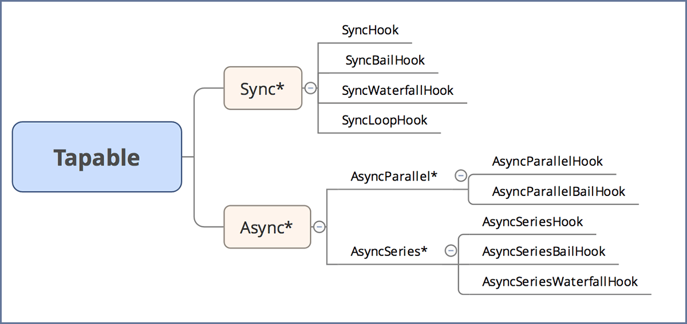

# Tapable

Webpack 本质上是一种事件流的机制，它的工作流程就是将各个插件串联起来，而实现这一切的核心就是 tapable，Webpack 中最核心的，负责编译的 Compiler 和负责创建 bundles 的 Compilation 都是 tapable 构造函数的实例。

The tapable package expose many Hook classes, which can be used to create hooks for plugins.

``` javascript
const {
  SyncHook,
  SyncBailHook,
  SyncWaterfallHook,
  SyncLoopHook,
  AsyncParallelHook,
  AsyncParallelBailHook,
  AsyncSeriesHook,
  AsyncSeriesBailHook,
  AsyncSeriesWaterfallHook
 } = require("tapable");
```

## hooks概览

常用的钩子主要包含以下几种，分为同步和异步，异步又分为并发执行和串行执行，如下图：



为方便描述

- 记所有事件处理函数队列为 tasks
- 记单个事件处理函数为 task

钩子的用法

| 序号 | 钩子名称 | 执行方式 | 使用要点 |
| :----: | :---- | :---- | :--- | :--- |
| 1 | SyncHook | 同步串行 | 不关心 task 的返回值 |
| 2 | SyncBailHook | 同步串行 | 只要 task 返回值不为 `undefined`，则跳过剩下所有的 tasks |
| 3 | SyncWaterfallHook | 同步串行 | 记录监听函数的不为 `undefined`的返回值，传给下一个的监听函数 |
| 4 | SyncLoopHook | 同步循环 | 如果 task 返回值 `!== undefined`，则重新重头循环一遍 tasks，直到返回值 === undefined，则继续向下执行其他tasks，以此类推 |
| 5 | AsyncParallelHook | 异步并发 | 不关心 task 返回值，如果一个done返回 err，则直接执行 done，并跳过后续所有还未执行的 tasks，如果任一 task 缺失 done 调用，则不会执行 done |
| 6 | AsyncParallelBailHook | 异步并发 | 具有 bail 功能的异步并发钩子 |
| 7 | AsyncSeriesHook | 异步串行 | 不关系 task 返回值，缺失任一 task，则终止后续所有 tasks |
| 8 | AsyncSeriesBailHook | 异步串行 | 具有 bail 功能的异步串行钩子 |
| 9 | AsyncSeriesWaterfallHook | 异步串行 | 具有 waterfall 功能的异步串行钩子 |

参考：

- [webpack4.0源码分析之Tapable](https://segmentfault.com/a/1190000016706654)

## 用法

All Hook constructors take one optional argument, which is a list of argument names as strings.

深刻理解，参见示例

Sync 类型的钩子

> Sync 类型 "钩子" 执行的插件都是顺序执行的，并且只能使用 `tap` 注册，可以使用 `call` 调用。

- [SyncHook](../examples/SyncHook.js)
- [SyncBailHook](../examples/SyncBailHook.js)
- [SyncWaterfallHook](../examples/SyncWaterfallHook.js)
- [SyncLoopHook](../examples/SyncLoopHook.js)

Async 类型的钩子

> Async 类型可以使用 `tap`、`tapAsync` 和 `tapPromise` 注册不同类型的插件 “钩子”，分别可以通过 `call`、`callAsync` 和 `promise` 方法调用。

**NOTE:** `tapAsync` `tapPromise` 注册的事件，都可以被 `callAsync` 或 `promise` 调用

AsyncParallelHook 为异步并行执行

- 通过 `tapAsync` 注册的事件，通过 `callAsync` 触发
  - `callAsync` 的最后一个参数为回调函数 done，在所有事件处理函数执行完毕后执行
- 通过 `tapPromise` 注册的事件，通过 `promise` 触发（返回值可以调用 `then` 方法）
  - 要求 `tapPromise` 注册的事件，必须返回一个 Promise 实例

- [AsyncParallelHook](../examples/AsyncParallelHook.js)
- [AsyncParallelBailHook](../examples/AsyncParallelBailHook.js)
- [AsyncSeriesHook](../examples/AsyncSeriesHook.js)
- [AsyncSeriesBailHook](../examples/AsyncSeriesBailHook.js)
- [AsyncSeriesWaterfallHook](../examples/AsyncParallelBailHook.js)

这篇 [blog](https://www.cnblogs.com/Darlietoothpaste/p/10474871.html) 有图示执行流程，可以结合理解原理

> **注意：**

在 `tapable` 源码中，注册事件的方法 `tab`、`tapAsync`、`tapPromise` 和触发事件的方法 `call`、`callAsync`、`promise` 都是通过 `compile` 方法快速编译出来的，如果想了解其实现 ，可以查看 `HookCodeFactory.js` 中的 `callTapsSeries`、`callTapsLooping`、`callTapsParallel` 三个方法的 code 输出。

## 综合示例

The best practice is to expose all hooks of a class in a `hooks` property:

这个是参考官方示例，综合使用场景展示完整的示例

实现参看 [examples](../examples/index.js)

```js
class Car {
  constructor() {
    this.hooks = {
      accelerate: new SyncHook(["newSpeed"]),
      brake: new SyncHook(),
      calculateRoutes: new AsyncParallelHook(["source", "target", "routesList"])
    };
  }

  /* ... */
}
```

Other people can now use these hooks:

``` js
const myCar = new Car();

// Use the tap method to add a consument
myCar.hooks.brake.tap("WarningLampPlugin", () => warningLamp.on());
```

It's required to pass a name to identify the plugin/reason.

You may receive arguments:

``` js
myCar.hooks.accelerate.tap("LoggerPlugin", newSpeed => console.log(`Accelerating to ${newSpeed}`));
```

For sync hooks, `tap` is the only valid method to add a plugin. Async hooks also support async plugins:

``` js
myCar.hooks.calculateRoutes.tapPromise("GoogleMapsPlugin", (source, target, routesList) => {
  // return a promise
  return google.maps.findRoute(source, target).then(route => {
    routesList.add(route);
  });
});
myCar.hooks.calculateRoutes.tapAsync("BingMapsPlugin", (source, target, routesList, callback) => {
  bing.findRoute(source, target, (err, route) => {
    if(err) return callback(err);
    routesList.add(route);
    // call the callback
    callback();
  });
});

// You can still use sync plugins
myCar.hooks.calculateRoutes.tap("CachedRoutesPlugin", (source, target, routesList) => {
  const cachedRoute = cache.get(source, target);
  if(cachedRoute)
    routesList.add(cachedRoute);
})
```
The class declaring these hooks need to call them:

``` js
class Car {
  /**
    * You won't get returned value from SyncHook or AsyncParallelHook,
    * to do that, use SyncWaterfallHook and AsyncSeriesWaterfallHook respectively
   **/

  setSpeed(newSpeed) {
    // following call returns undefined even when you returned values
    this.hooks.accelerate.call(newSpeed);
  }

  useNavigationSystemPromise(source, target) {
    const routesList = new List();
    return this.hooks.calculateRoutes.promise(source, target, routesList).then((res) => {
      // res is undefined for AsyncParallelHook
      return routesList.getRoutes();
    });
  }

  useNavigationSystemAsync(source, target, callback) {
    const routesList = new List();
    this.hooks.calculateRoutes.callAsync(source, target, routesList, err => {
      if(err) return callback(err);
      callback(null, routesList.getRoutes());
    });
  }
}
```

The Hook will compile a method with the most efficient way of running your plugins. It generates code depending on:
* The number of registered plugins (none, one, many)
* The kind of registered plugins (sync, async, promise)
* The used call method (sync, async, promise)
* The number of arguments
* Whether interception is used

This ensures fastest possible execution.

## Hook types

Each hook can be tapped with one or several functions. How they are executed depends on the hook type:

* Basic hook (without “Waterfall”, “Bail” or “Loop” in its name). This hook simply calls every function it tapped in a row.

* __Waterfall__. A waterfall hook also calls each tapped function in a row. Unlike the basic hook, it passes a return value from each function to the next function.

* __Bail__. A bail hook allows exiting early. When any of the tapped function returns anything, the bail hook will stop executing the remaining ones.

* __Loop__. TODO

Additionally, hooks can be synchronous or asynchronous. To reflect this, there’re “Sync”, “AsyncSeries”, and “AsyncParallel” hook classes:

* __Sync__. A sync hook can only be tapped with synchronous functions (using `myHook.tap()`).

* __AsyncSeries__. An async-series hook can be tapped with synchronous, callback-based and promise-based functions (using `myHook.tap()`, `myHook.tapAsync()` and `myHook.tapPromise()`). They call each async method in a row.

* __AsyncParallel__. An async-parallel hook can also be tapped with synchronous, callback-based and promise-based functions (using `myHook.tap()`, `myHook.tapAsync()` and `myHook.tapPromise()`). However, they run each async method in parallel.

The hook type is reflected in its class name. E.g., `AsyncSeriesWaterfallHook` allows asynchronous functions and runs them in series, passing each function’s return value into the next function.


## Interception

All Hooks offer an additional interception API:

``` js
myCar.hooks.calculateRoutes.intercept({
  call: (source, target, routesList) => {
    console.log("Starting to calculate routes");
  },
  register: (tapInfo) => {
    // tapInfo = { type: "promise", name: "GoogleMapsPlugin", fn: ... }
    console.log(`${tapInfo.name} is doing its job`);
    return tapInfo; // may return a new tapInfo object
  }
})
```

**call**: `(...args) => void` Adding `call` to your interceptor will trigger when hooks are triggered. You have access to the hooks arguments.

**tap**: `(tap: Tap) => void` Adding `tap` to your interceptor will trigger when a plugin taps into a hook. Provided is the `Tap` object. `Tap` object can't be changed.

**loop**: `(...args) => void` Adding `loop` to your interceptor will trigger for each loop of a looping hook.

**register**: `(tap: Tap) => Tap | undefined` Adding `register` to your interceptor will trigger for each added `Tap` and allows to modify it.

## Context

Plugins and interceptors can opt-in to access an optional `context` object, which can be used to pass arbitrary values to subsequent plugins and interceptors.

``` js
myCar.hooks.accelerate.intercept({
  context: true,
  tap: (context, tapInfo) => {
    // tapInfo = { type: "sync", name: "NoisePlugin", fn: ... }
    console.log(`${tapInfo.name} is doing it's job`);

    // `context` starts as an empty object if at least one plugin uses `context: true`.
    // If no plugins use `context: true`, then `context` is undefined.
    if (context) {
      // Arbitrary properties can be added to `context`, which plugins can then access.
      context.hasMuffler = true;
    }
  }
});

myCar.hooks.accelerate.tap({
  name: "NoisePlugin",
  context: true
}, (context, newSpeed) => {
  if (context && context.hasMuffler) {
    console.log("Silence...");
  } else {
    console.log("Vroom!");
  }
});
```

## HookMap

A HookMap is a helper class for a Map with Hooks

``` js
const keyedHook = new HookMap(key => new SyncHook(["arg"]))
```

``` js
keyedHook.for("some-key").tap("MyPlugin", (arg) => { /* ... */ });
keyedHook.for("some-key").tapAsync("MyPlugin", (arg, callback) => { /* ... */ });
keyedHook.for("some-key").tapPromise("MyPlugin", (arg) => { /* ... */ });
```

``` js
const hook = keyedHook.get("some-key");
if(hook !== undefined) {
  hook.callAsync("arg", err => { /* ... */ });
}
```

## Hook/HookMap interface

Public:

``` ts
interface Hook {
  tap: (name: string | Tap, fn: (context?, ...args) => Result) => void,
  tapAsync: (name: string | Tap, fn: (context?, ...args, callback: (err, result: Result) => void) => void) => void,
  tapPromise: (name: string | Tap, fn: (context?, ...args) => Promise<Result>) => void,
  intercept: (interceptor: HookInterceptor) => void
}

interface HookInterceptor {
  call: (context?, ...args) => void,
  loop: (context?, ...args) => void,
  tap: (context?, tap: Tap) => void,
  register: (tap: Tap) => Tap,
  context: boolean
}

interface HookMap {
  for: (key: any) => Hook,
  intercept: (interceptor: HookMapInterceptor) => void
}

interface HookMapInterceptor {
  factory: (key: any, hook: Hook) => Hook
}

interface Tap {
  name: string,
  type: string
  fn: Function,
  stage: number,
  context: boolean,
  before?: string | Array
}
```

Protected (only for the class containing the hook):

``` ts
interface Hook {
  isUsed: () => boolean,
  call: (...args) => Result,
  promise: (...args) => Promise<Result>,
  callAsync: (...args, callback: (err, result: Result) => void) => void,
}

interface HookMap {
  get: (key: any) => Hook | undefined,
  for: (key: any) => Hook
}
```

## MultiHook

A helper Hook-like class to redirect taps to multiple other hooks:

``` js
const { MultiHook } = require("tapable");

this.hooks.allHooks = new MultiHook([this.hooks.hookA, this.hooks.hookB]);
```
